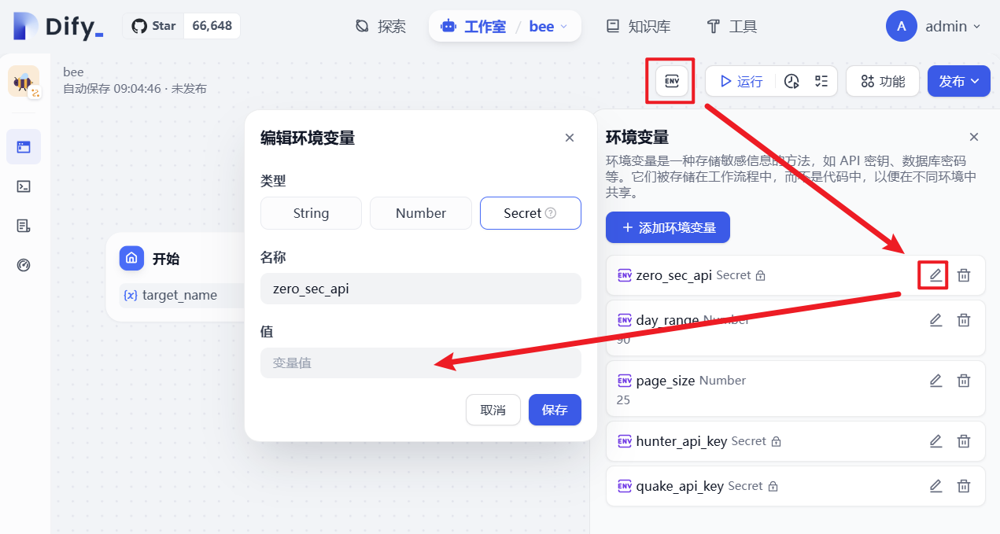

# 🐝Bee

输入目标名称，从 Hunter、 Quake、零零信安 获取目标域名和ip。

## 操作步骤

1. 复制 [DSL 连接](https://github.com/din4e/DifyDSL4RedTeam/blob/main/dsl/bee.yml)
   
    

2. `工作室 > 导入 DSL 文件 > URL`

    

3. 在环境变量中填写 Hunter、Quake、零零信安的 API Key

    

4. 运行！

## 注意事项

1. 目前零零信安误报较高；
2.  Hunter、Quake暂不支持大数据量的分页；