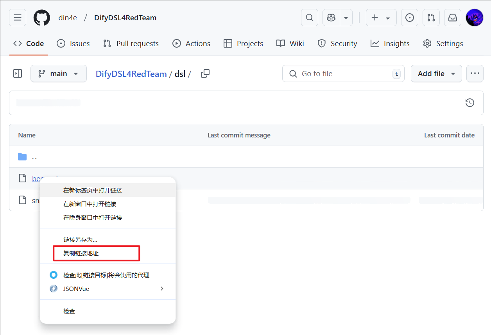
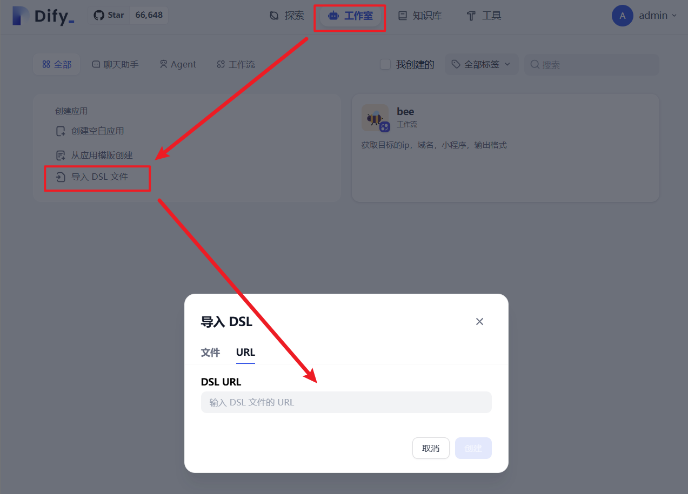
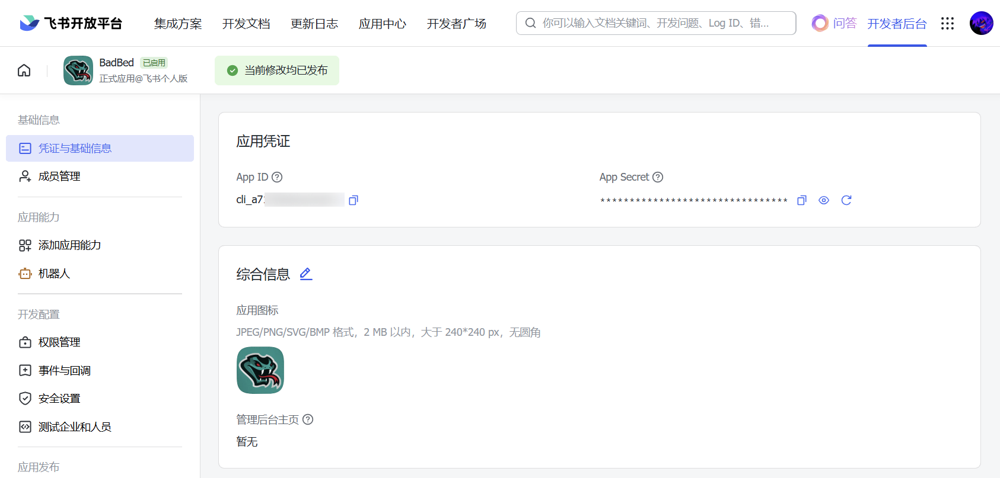
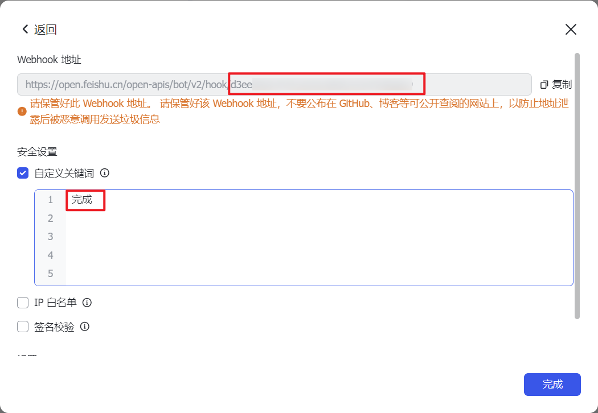
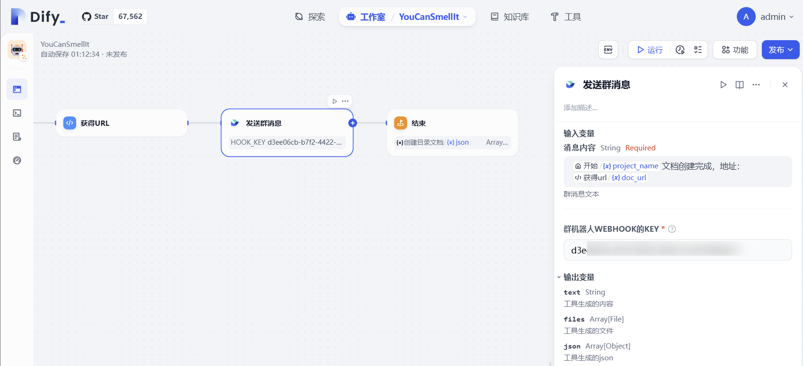

# 🐍 Snake

输入项目名称和单位列表，处理数据后获取单位的域名和ip，创建文档用于协作并在飞书群通知。

 

## 操作步骤

1. 复制 [DSL 连接](https://github.com/din4e/DifyDSL4RedTeam/blob/main/dsl/snake.yml)
   
    

2. `工作室 > 导入 DSL 文件 > URL`

    

3. 先引入 [🐝Bee](./bee.md)，完成相关配置，输入修改为循环的 `/item`，修改联通和相关失效变量

    

4. 配置飞书应用 `app_id`、`app_asccess_token`并开通相应权限，需要在授权和环境变量中配置
   
    
    
    
    
5. 添加以及机器人 Webhook 地址，需要配置自定义关键词确保消息推送
   
    
    

6. 运行！

    

## 注意事项

1. [[🐝Bee]](./bee.md) 目前零零信安误报较高；
2. [[🐝Bee]](./bee.md) Hunter、Quake暂不支持大数据量的分页；