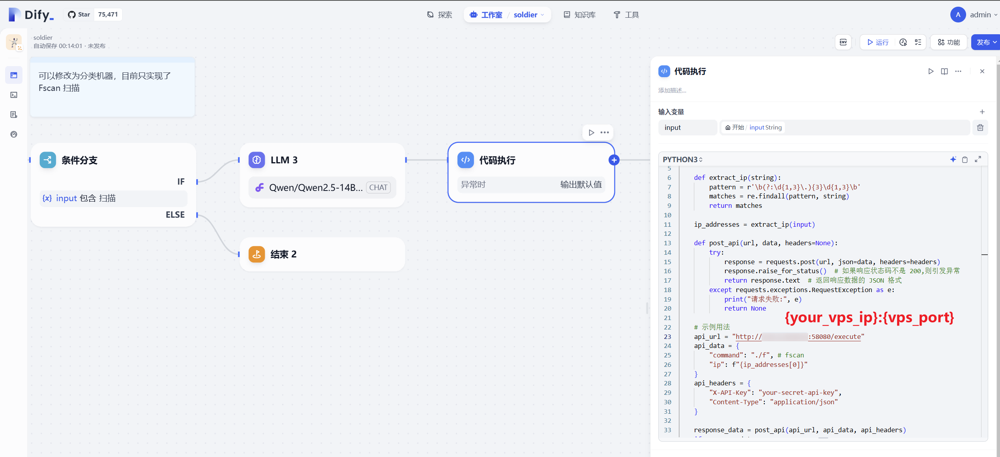
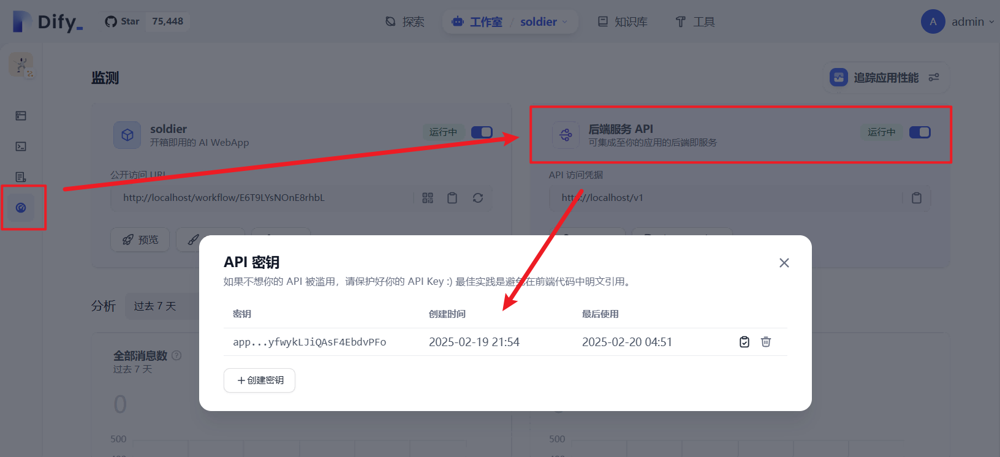
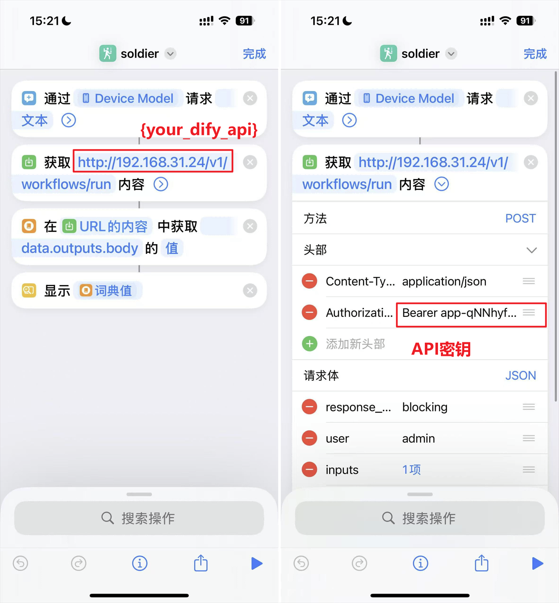
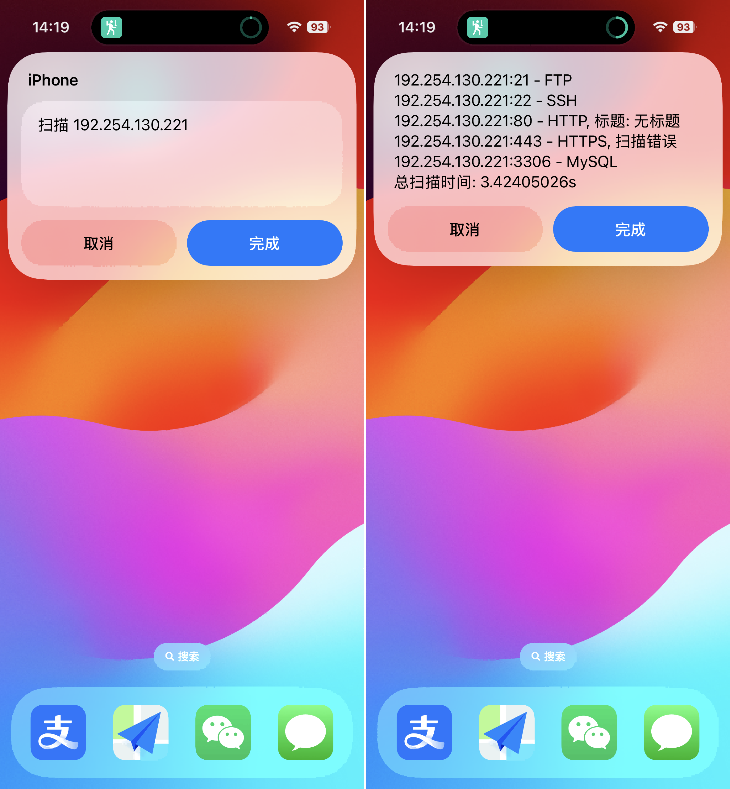

# 🤺 Soldier

手机输入指令，进行扫描任务，例如fscan等（POC版本，非常脆弱，但是非常酷）。  
基本思路就是：快捷指令->dify workflow api->命令执行api->结果反馈->wolkflow处理->返回

 


## 操作步骤

1. 复制 [DSL 连接](https://github.com/din4e/DifyDSL4RedTeam/blob/main/dsl/soldier.yml)
   
    

2. `工作室 > 导入 DSL 文件 > URL`

    

3. vps 编译配置和启动名称执行 web 服务，使用 FastAPI/Gin 等任意语言实现
   
   go 实现一个 api，开发在 http://{vps_ip}:58080，输入 api-key 和 ip 执行 `fscan -h {ip} -nobr -nopoc`

    ```go
    package main
    import (
        "net/http"
        "os/exec"
        "fmt"
        "github.com/gin-gonic/gin"
    )

    const (
        APIKeyName = "X-API-Key"
        APIKey     = "your-secret-api-key"
    )

    func main() {
        router := gin.Default()
        router.POST("/execute", apiKeyAuth, executeCommand)

        router.Run(":58080")
    }

    func apiKeyAuth(c *gin.Context) {
        apiKey := c.GetHeader(APIKeyName)
        if apiKey != APIKey {
            c.AbortWithStatusJSON(http.StatusUnauthorized, gin.H{"error": "Invalid API Key"})
            return
        }
        c.Next()
    }

    func executeCommand(c *gin.Context) {
        var req struct {
            Command string `json:"command"`
            IP      string `json:"ip"`
        }
        if err := c.BindJSON(&req); err != nil {
            c.JSON(http.StatusBadRequest, gin.H{"error": err.Error()})
            return
        }

        command := req.Command + " -h " + req.IP + " -nobr -nopoc" 
    fmt.Println(command)
        cmd := exec.Command("bash", "-c", command)
        output, err := cmd.CombinedOutput()
        if err != nil {
        fmt.Println(err)
            c.JSON(http.StatusInternalServerError, gin.H{"error": string(output)})
            return
        }

        c.JSON(http.StatusOK, gin.H{"output": string(output)})
    }
    ```
    登录 vps，依次编译启动
    ```bash
    go init mod dify_api
    go build dify_api
    chmod +x ./dify_api && ./dify_api
    ```

4. 修改执行 vps_ip 和对应 APIKey（步骤3设置的），启动 workflow api

    
    


5. 设置快捷指令，参考视频 [【什么是API？DeepSeek技巧升级2.0～】【精准空降到 23:12】](https://www.bilibili.com/video/BV1LEKMexEV7/?share_source=copy_web&vd_source=ee048efbc98d2a6062e36360706d93d6&t=1392)  
    可以使用[此文件](../dsl/soldier.shortcut)导入快捷指令，记得修改 dify api ip 和对应API密钥（步骤 4图二的app***）。
    

6. 运行！
    


## 注意事项

1. 本质还是 API 调用，存在链路过长，排查困难的问题；
2. 存在潜在的 RCE 风险，建议命令执行放在docker中使用，加强指令过滤；
3. 只是一个基座，其他工具可以往里面缝；
4. 试过语音识别，体感比较拉，而且反复测试的时候念 “扫描 192.168.1.1” 挺呆的🤣。